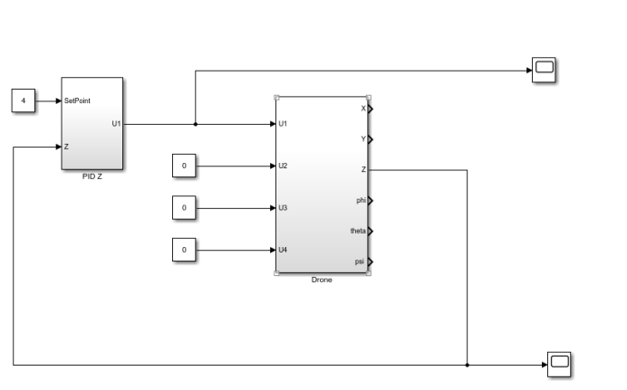
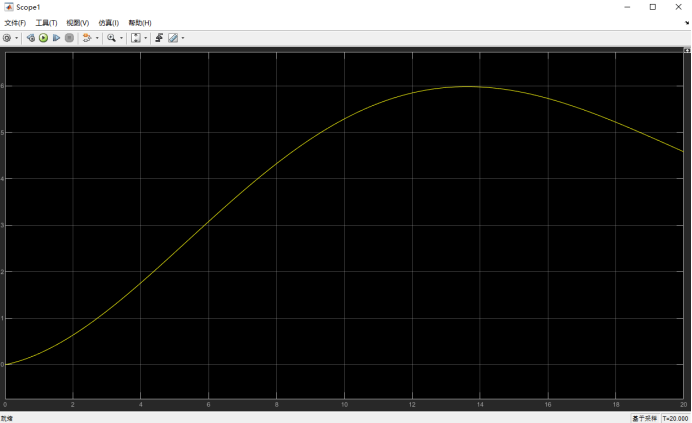
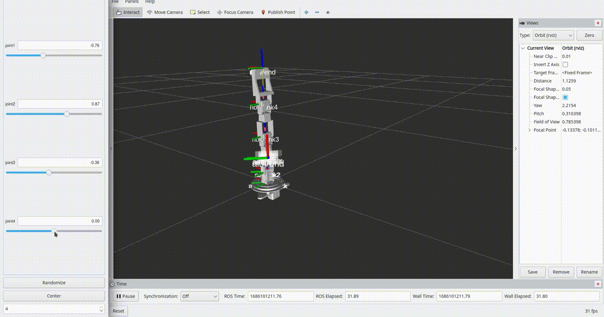
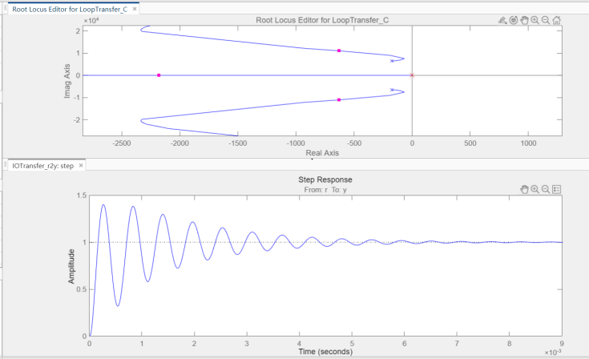
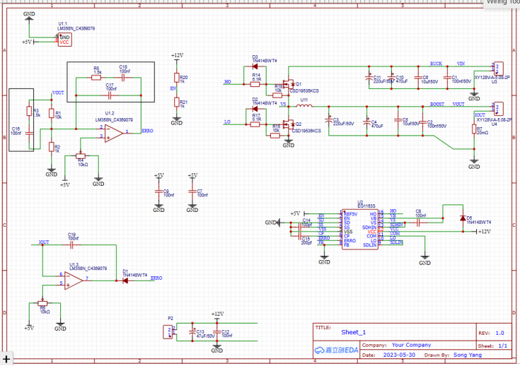
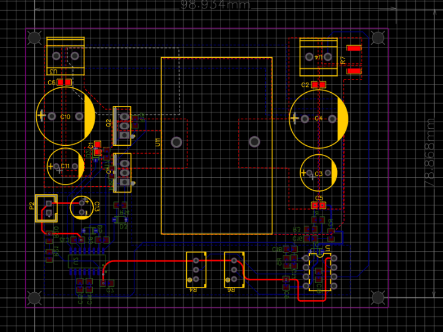
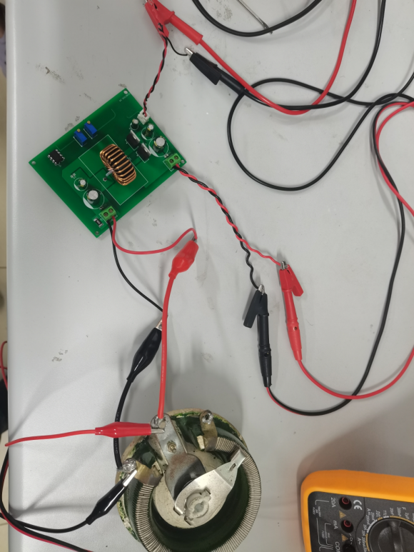
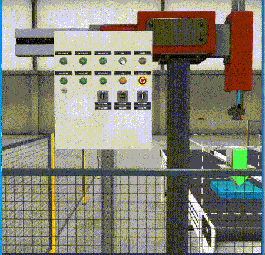

# 四旋翼无人机建模与简化

以四旋翼无人为研究对象，根据其物理模型，选择十二个状态变量与四个输出变量建立系统的状态空间模型，分析了其能控性、能观性、稳定性，并且求解其单位冲激响应、阶跃响应，进行了状态反馈控制器以及状态观测控制器的设计。

然后基于合理的假设对无人机的状态模型进行简化，成功配置简化后状态观测极点，最后在Simulink进行多输入多输出的系统反馈控制器和系统观测器设计，得到了设置反馈极点之后的稳定闭环控制系统。

# 基于ROS系统的三次多项式机械臂仿真

在ROS系统中导入solid works中建立的机械臂模型，并进行三次多项式机械臂轨迹规划的仿真。

# 30V/1A 闭环控制同步整流buck电路方案

采用EG1163S芯片设计同步整流BUCK降压电路，实现降压输出，输出电压可调，实现电压闭环控制、短路保护等功能。

先进行器件选型、热设计，在立创EDA中绘制电路原理图与PCB板，并进行调试。

在电压闭环控制回路设计中，采用三阶补偿器，得到三阶补偿器的传递函数后使用Matlab进行零极点配置，在兼顾稳定性和快速性的情况下,反解出所需的电阻值和电容值。

在设定值为12V的情况下，输入30V电压输出12.5V，与理想输出值12V相比，误差为4.17%。

# 基于PLC的气动机械手控制

实现目标：

1、⽓动机械⼿的升降和左右移⾏分别由不同的双线圈电磁阀来实现，电磁阀线圈失电时能保持原来的状态，必须驱动反向的线圈才能反向运动；

2、上升、下降的电磁阀线圈分别为 YV2、YV1；右⾏、左⾏的电磁阀线圈
为 YV3、YV4；

3、机械⼿的夹钳由单线圈电磁阀 YV5 来实现，线圈通电时夹紧⼯件，线圈断电时松开⼯件；

4、机械⼿的夹钳的松开、夹紧通过延时 1.7S 实现；

5、机械⼿的下降、上升、右⾏、左⾏的限位由⾏程开关 SQ1、SQ2、SQ3、SQ4 来实现；

实现方法

选用博图V18仿真软件，采用西门子plc的S7-1200，1214C AC/DC型CPU，使用Factory IO软件中的模型搭建工作站，并联合进行仿真，编程语言为SCL语言与梯形图相结合。

在整个控制流程设计中，对系统进行分析并分块实现，将底层逻辑的实现防止在SCL程序块中，每个板块之间的关系由梯形图呈现，更为直观，可读性强。

# 一种自动垃圾分类机构

参与设计了一种基于多种传感器的智能分类垃圾桶，几乎所有的垃圾识别算法都是通过图像分类来完成的，这并不能完全描述一个垃圾。相比纯视觉方案，该垃圾桶设计了多种传感器，采集垃圾的密度、重量、硬度等信息，并根据所有的信息进行四分类，分类准确率显著高于纯视觉方案。我在项目中负责识别算法的编写，下面是实物演示图。

